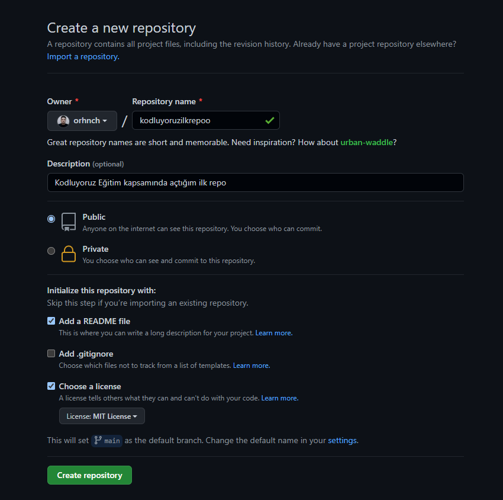

# Kodluyoruz İlk Repo
Kodluyoruz Eğitimi kapsamında açtığım ilk repo. İçerisinde bir adet ReadME ve bir de index.html dosyası barındırıyor.




## Installation

-----
`git clone https://github.com/orhnch/kodluyoruzilkrepo.git`

## Usage

---
Projeyi cloneladıktan sonra Visual Studio Code programında açınız.
### Windows için:
``` 
cd kodluyoruzilkrepo 
code . 
```
## Contributing

---
Pull requestler kabul edilir. Büyük değişiklikler için, lütfen önce neyi değiştirmek istediğinizi tartışmak için bir konu açınız.

## License
---
[MIT](https://github.com/orhnch/kodluyoruzilkrepo/blob/main/LICENSE)